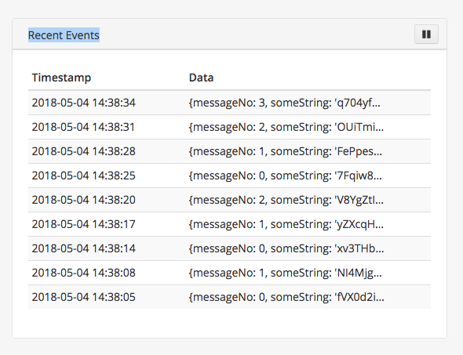

# data-integration-hackathon

## Start here

1. [Login](https://www.streamr.com/login/auth) or [register](https://www.streamr.com/register/signup) to Streamr
2. Grab your user API key from [here](https://www.streamr.com/profile/edit)
3. `git clone git@github.com:streamr-dev/data-integration-hackathon.git`
4. `npm install`
5. Open `app.js` in your IDE/editor of choice
6. Edit constants `STREAM_NAME` (use your imagination) and `API_KEY` (use your API key grabbed above)
7. `npm start`
8. If everything works, you should see `Event sent: {...}` style logging in standard output.
9. Go to [Streams list page](https://www.streamr.com/stream/list), find your newly created Stream, and ensure data is
flowing in by looking at the Recent Events tab, e.g.,



**You are ready to hack!**


## TODO: End here
- Something about configuring fields and using autodetect for Streams
- Pushing to EC2 with Mikhael

## Links
- [Documentation for streamr-client](https://github.com/streamr-dev/streamr-client)
- [Streamr API Swagger](https://www.streamr.com/help/api)

## Troubleshooting


### API key is wrong:
```
Error: Request to https://www.streamr.com/api/v1/streams?name=my-sweet-stream&public=false returned with error code 401: {"code":"NOT_AUTHENTICATED","message":"Not authenticated via token or cookie"}
```
